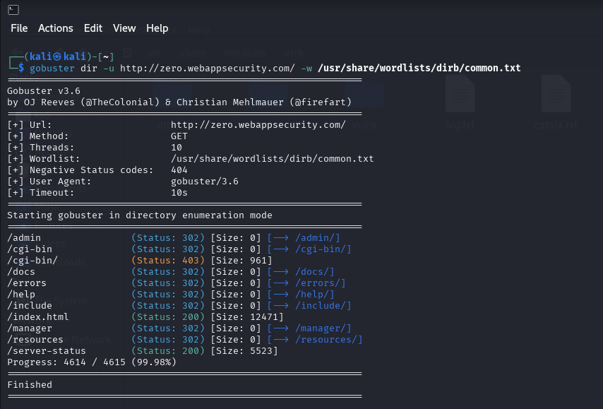
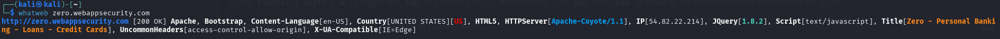

# 📖 Information Gathering

First step to perform a Penetration testing against a Web application is to do a reconnaissance. In this phase we try to gather as much information as possible about our target website, 
this informations can be helpful in understanding the application, identifying Vulnerabilities and planning attacks.

Common Techniques used for Reconnaissance for web application:

- Fingerprinting: Identify underyling technology such as programming language, Database and webserver.
- Directory and file enumeration: Identifying hidden directories and files on the web server.
- DNS lookups: Finding subdomains, DNS records, and other DNS-related information.
- Network scanning: Identifying open ports, services, and potentially exposed systems using tools like Nmap.

---

## Directory and File enumeration

Technique to identifying and listing the hidden directories and files on the server. Directory Enumeration can be performed by using dirb, dirbuster, gobuster and dirsearch.

Here we use gobuster for directory enumertion by running the following command in terminal.

```bash
gobuster dir -u http://zero.webappsecurity.com/ -w /usr/share/wordlists/dirb/common.txt 
```

Breakdown of the command:

- ***dir***       &nbsp;&nbsp;&nbsp;&nbsp;      Uses directory/file enumeration mode.
- ***-u***        &nbsp;&nbsp;&nbsp;&nbsp;      URL of the Web application.
- ***-w***        &nbsp;&nbsp;&nbsp;&nbsp;      Path to the wordlist.

Result from gobuster:




From the above result, we can see that the gobuster has identified some important directories such as /admin, /cgi-bin, /docs, /manager etc. 
This enumeration process has basically increased the attack surface, by discovering these hidden directories. Attacker can look into these directories to identify vulnerabilities and ways to expolit them.

---

## Fingerprinting

Use of fingerprinting is to findout the underlying technology that the web application is used to be built.

For this purpose we can use tools like whatweb.

```bash
whatweb zero.webappsecurity.com
```

Result from whatweb:




